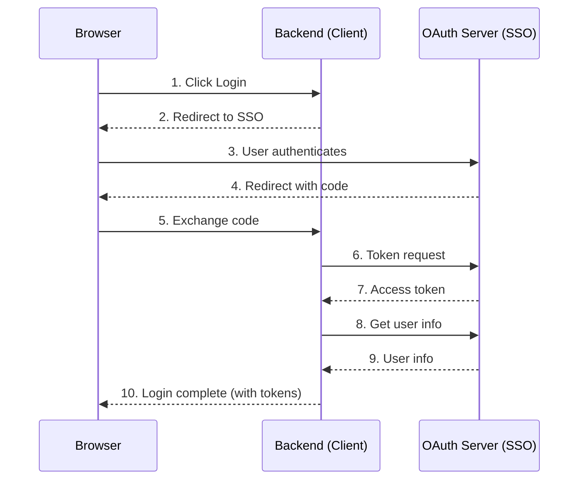

# OAuth 2.0 SSO Integration Guide

> **[中文版](./oauth2-integration_CN.md)**

This guide explains how to integrate RMS Discord Clone with any OAuth 2.0 compliant SSO provider.

## Overview

RMS Discord Clone implements the **OAuth 2.0 Authorization Code Grant** flow as a client application. It can integrate with any standard OAuth 2.0 / OpenID Connect provider.



## Configuration

### Backend Configuration

Edit `backend/config.json`:

```json
{
  "oauth_base_url": "https://sso.example.com",
  "oauth_authorize_endpoint": "/oauth/authorize",
  "oauth_token_endpoint": "/oauth/token",
  "oauth_userinfo_endpoint": "/oauth/userinfo",
  "oauth_client_id": "your-client-id",
  "oauth_client_secret": "your-client-secret",
  "oauth_redirect_uri": "https://your-app.com/api/auth/callback",
  "oauth_scope": "openid profile"
}
```

| Field | Description |
|-------|-------------|
| `oauth_base_url` | Base URL of the OAuth server |
| `oauth_authorize_endpoint` | Authorization endpoint path |
| `oauth_token_endpoint` | Token exchange endpoint path |
| `oauth_userinfo_endpoint` | User info endpoint path |
| `oauth_client_id` | Client ID from OAuth provider |
| `oauth_client_secret` | Client secret from OAuth provider |
| `oauth_redirect_uri` | Callback URL (must be registered with provider) |
| `oauth_scope` | OAuth scopes to request |

### Register with OAuth Provider

When registering your application with the OAuth provider, use these settings:

| Setting | Value |
|---------|-------|
| **Redirect URI** | `https://your-domain.com/api/auth/callback` |
| **Grant Type** | Authorization Code |
| **Scopes** | `openid profile` (minimum) |

## API Endpoints

### GET /api/auth/login

Initiates the OAuth flow by redirecting to the SSO provider.

**Query Parameters:**

| Parameter | Required | Description |
|-----------|----------|-------------|
| `redirect_url` | No | URL to redirect after login (default: `{cors_origin}/callback`) |

**Example:**

```
GET /api/auth/login?redirect_url=https://your-app.com/callback
```

**Response:** 302 redirect to OAuth authorization URL

---

### GET /api/auth/callback

OAuth callback endpoint. Handles the authorization code exchange.

**Query Parameters:**

| Parameter | Required | Description |
|-----------|----------|-------------|
| `code` | Yes | Authorization code from OAuth provider |
| `state` | Yes | State parameter for CSRF protection |

**Response:** 302 redirect to frontend with tokens

For web clients (non-localhost), tokens are passed via URL fragment:
```
https://your-app.com/callback#access_token=xxx&refresh_token=xxx
```

For native/localhost clients, tokens are passed via query string:
```
http://localhost:3000/callback?access_token=xxx&refresh_token=xxx
```

---

### POST /api/auth/refresh

Refresh the access token using a refresh token.

**Request Body:**

```json
{
  "refresh_token": "your-refresh-token"
}
```

**Response:**

```json
{
  "access_token": "new-access-token",
  "token_type": "Bearer",
  "expires_in": 3600
}
```

---

### POST /api/auth/logout

Revoke the refresh token and logout.

**Request Body:**

```json
{
  "refresh_token": "your-refresh-token"
}
```

**Response:**

```json
{
  "success": true,
  "message": "Logged out successfully"
}
```

---

### GET /api/auth/me

Get current user information. Requires authentication.

**Headers:**

```
Authorization: Bearer <access_token>
```

**Response:**

```json
{
  "success": true,
  "user": {
    "id": 12345,
    "username": "johndoe",
    "nickname": "John Doe",
    "permission_level": 1
  }
}
```

---

### GET /api/auth/dev-login

Development-only endpoint for testing without SSO. Only available when `debug: true`.

**Response:** 302 redirect to callback with mock tokens

## User Info Mapping

The backend expects these fields from the OAuth userinfo endpoint:

| Required Field | Accepted Names |
|----------------|----------------|
| User ID | `id` or `sub` |
| Username | `username` or `preferred_username` |
| Display Name | `nickname` or `name` |
| Permission Level | `permission_level` (default: 0) |

If your OAuth provider uses different field names, modify `backend/routers/auth.py`:

```python
# In callback() function, around line 230
user_id = user_info.get("id") or user_info.get("sub")
username = user_info.get("username") or user_info.get("preferred_username")
nickname = user_info.get("nickname") or user_info.get("name")
permission_level = user_info.get("permission_level", 0)
```

## Token Lifecycle

### Access Token

- **Lifetime:** 60 minutes (configurable via `access_token_expire_minutes`)
- **Format:** JWT signed with `jwt_secret`
- **Usage:** Include in `Authorization: Bearer <token>` header

### Refresh Token

- **Lifetime:** 30 days (configurable via `refresh_token_expire_days`)
- **Storage:** SHA-256 hash stored in database (`auth_refresh_tokens` table)
- **Usage:** Exchange for new access token via `/api/auth/refresh`

## Security Features

### State Parameter

The `state` parameter is a JWT containing:
- `r`: Original redirect URL
- `nonce`: Random string for uniqueness
- `exp`: Expiration time (10 minutes)
- `iat`: Issued at time

### Redirect URL Validation

Only these redirect URLs are allowed:
- URLs with origin in `cors_origins` and path starting with `/callback`
- Localhost URLs (`http://localhost:*/callback`, `http://127.0.0.1:*/callback`)
- Android deep link (`rmschatroom://callback`)

### Token Delivery

- **Web clients:** Tokens delivered via URL fragment (`#access_token=...`) to prevent leakage in server logs
- **Native clients:** Tokens delivered via query string (`?access_token=...`)

## Provider-Specific Notes

### Keycloak

```json
{
  "oauth_base_url": "https://keycloak.example.com/realms/your-realm",
  "oauth_authorize_endpoint": "/protocol/openid-connect/auth",
  "oauth_token_endpoint": "/protocol/openid-connect/token",
  "oauth_userinfo_endpoint": "/protocol/openid-connect/userinfo",
  "oauth_scope": "openid profile"
}
```

### Auth0

```json
{
  "oauth_base_url": "https://your-tenant.auth0.com",
  "oauth_authorize_endpoint": "/authorize",
  "oauth_token_endpoint": "/oauth/token",
  "oauth_userinfo_endpoint": "/userinfo",
  "oauth_scope": "openid profile"
}
```

### Azure AD

```json
{
  "oauth_base_url": "https://login.microsoftonline.com/your-tenant-id",
  "oauth_authorize_endpoint": "/oauth2/v2.0/authorize",
  "oauth_token_endpoint": "/oauth2/v2.0/token",
  "oauth_userinfo_endpoint": "https://graph.microsoft.com/oidc/userinfo",
  "oauth_scope": "openid profile"
}
```

Note: Azure AD userinfo endpoint is on a different domain. The backend supports full URLs in `oauth_userinfo_endpoint`.

### Google

```json
{
  "oauth_base_url": "https://accounts.google.com",
  "oauth_authorize_endpoint": "/o/oauth2/v2/auth",
  "oauth_token_endpoint": "https://oauth2.googleapis.com/token",
  "oauth_userinfo_endpoint": "https://openidconnect.googleapis.com/v1/userinfo",
  "oauth_scope": "openid profile"
}
```

## Testing

### Local Mock Server

For development without a real OAuth provider, use the included mock server:

```bash
cd backend
python mock_oauth_server.py
```

Configure backend to use mock server:

```json
{
  "oauth_base_url": "http://localhost:9000",
  "oauth_client_id": "test-client",
  "oauth_client_secret": "test-secret"
}
```

### Dev Login

With `debug: true`, use the dev login endpoint:

```
GET /api/auth/dev-login
```

This creates a mock admin user without requiring OAuth.

## Troubleshooting

### "Invalid redirect_url" Error

Ensure your redirect URL:
1. Is in the `cors_origins` list
2. Has path starting with `/callback`
3. Uses the same protocol (http/https) as configured

### "Token exchange failed" Error

Check:
1. `oauth_client_id` and `oauth_client_secret` are correct
2. `oauth_redirect_uri` matches what's registered with the provider
3. OAuth server is reachable from your backend

### "Missing user id or username" Error

Your OAuth provider's userinfo response doesn't include expected fields. Check the field mapping section above.
