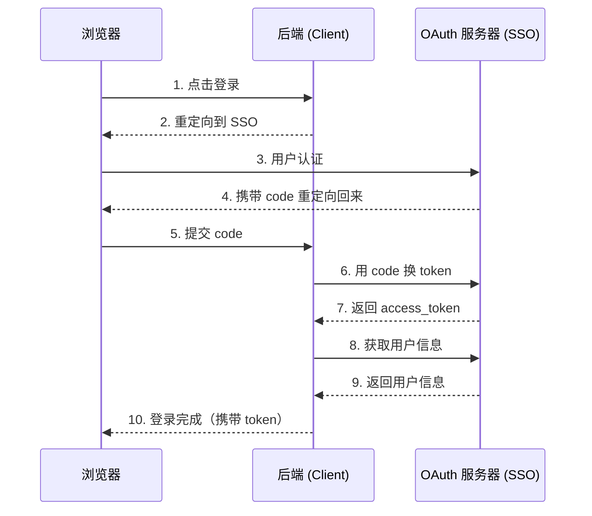

# OAuth 2.0 SSO 接入指南

> **[English](./oauth2-integration.md)**

本指南介绍如何将 RMS Discord Clone 与任意 OAuth 2.0 兼容的 SSO 系统对接。

## 概述

RMS Discord Clone 作为 OAuth 2.0 客户端，实现了 **Authorization Code Grant** 授权码模式。可以对接任何标准的 OAuth 2.0 / OpenID Connect 提供商。



## 配置说明

### 后端配置

编辑 `backend/config.json`：

```json
{
  "oauth_base_url": "https://sso.example.com",
  "oauth_authorize_endpoint": "/oauth/authorize",
  "oauth_token_endpoint": "/oauth/token",
  "oauth_userinfo_endpoint": "/oauth/userinfo",
  "oauth_client_id": "你的 client_id",
  "oauth_client_secret": "你的 client_secret",
  "oauth_redirect_uri": "https://your-app.com/api/auth/callback",
  "oauth_scope": "openid profile"
}
```

| 字段 | 说明 |
|------|------|
| `oauth_base_url` | OAuth 服务器基础 URL |
| `oauth_authorize_endpoint` | 授权端点路径 |
| `oauth_token_endpoint` | Token 交换端点路径 |
| `oauth_userinfo_endpoint` | 用户信息端点路径 |
| `oauth_client_id` | 从 OAuth 提供商获取的 Client ID |
| `oauth_client_secret` | 从 OAuth 提供商获取的 Client Secret |
| `oauth_redirect_uri` | 回调 URL（需在提供商处注册） |
| `oauth_scope` | 请求的 OAuth 权限范围 |

### 在 OAuth 提供商处注册

在 OAuth 提供商处注册应用时，使用以下配置：

| 配置项 | 值 |
|--------|-----|
| **回调 URI** | `https://your-domain.com/api/auth/callback` |
| **授权类型** | Authorization Code |
| **权限范围** | `openid profile`（最小要求） |

## API 端点

### GET /api/auth/login

发起 OAuth 登录流程，重定向到 SSO 提供商。

**请求参数：**

| 参数 | 必填 | 说明 |
|------|------|------|
| `redirect_url` | 否 | 登录后跳转的 URL（默认：`{cors_origin}/callback`） |

**示例：**

```
GET /api/auth/login?redirect_url=https://your-app.com/callback
```

**响应：** 302 重定向到 OAuth 授权页面

---

### GET /api/auth/callback

OAuth 回调端点，处理授权码交换。

**请求参数：**

| 参数 | 必填 | 说明 |
|------|------|------|
| `code` | 是 | OAuth 提供商返回的授权码 |
| `state` | 是 | 用于 CSRF 防护的 state 参数 |

**响应：** 302 重定向到前端并携带 token

Web 客户端（非 localhost）通过 URL fragment 传递 token：
```
https://your-app.com/callback#access_token=xxx&refresh_token=xxx
```

原生/localhost 客户端通过 query string 传递 token：
```
http://localhost:3000/callback?access_token=xxx&refresh_token=xxx
```

---

### POST /api/auth/refresh

使用 refresh token 刷新 access token。

**请求体：**

```json
{
  "refresh_token": "你的 refresh_token"
}
```

**响应：**

```json
{
  "access_token": "新的 access_token",
  "token_type": "Bearer",
  "expires_in": 3600
}
```

---

### POST /api/auth/logout

注销登录，撤销 refresh token。

**请求体：**

```json
{
  "refresh_token": "你的 refresh_token"
}
```

**响应：**

```json
{
  "success": true,
  "message": "Logged out successfully"
}
```

---

### GET /api/auth/me

获取当前用户信息，需要认证。

**请求头：**

```
Authorization: Bearer <access_token>
```

**响应：**

```json
{
  "success": true,
  "user": {
    "id": 12345,
    "username": "johndoe",
    "nickname": "John Doe",
    "permission_level": 1
  }
}
```

---

### GET /api/auth/dev-login

开发环境专用端点，用于无 SSO 测试。仅在 `debug: true` 时可用。

**响应：** 302 重定向到 callback 并携带模拟 token

## 用户信息字段映射

后端期望从 OAuth userinfo 端点获取以下字段：

| 必需字段 | 接受的字段名 |
|----------|-------------|
| 用户 ID | `id` 或 `sub` |
| 用户名 | `username` 或 `preferred_username` |
| 显示名称 | `nickname` 或 `name` |
| 权限等级 | `permission_level`（默认：0） |

如果你的 OAuth 提供商使用不同的字段名，修改 `backend/routers/auth.py`：

```python
# 在 callback() 函数中，约第 230 行
user_id = user_info.get("id") or user_info.get("sub")
username = user_info.get("username") or user_info.get("preferred_username")
nickname = user_info.get("nickname") or user_info.get("name")
permission_level = user_info.get("permission_level", 0)
```

## Token 生命周期

### Access Token

- **有效期：** 60 分钟（可通过 `access_token_expire_minutes` 配置）
- **格式：** 使用 `jwt_secret` 签名的 JWT
- **使用方式：** 在请求头中添加 `Authorization: Bearer <token>`

### Refresh Token

- **有效期：** 30 天（可通过 `refresh_token_expire_days` 配置）
- **存储：** SHA-256 哈希存储在数据库 `auth_refresh_tokens` 表中
- **使用方式：** 通过 `/api/auth/refresh` 换取新的 access token

## 安全特性

### State 参数

`state` 参数是一个 JWT，包含：
- `r`：原始重定向 URL
- `nonce`：随机字符串，确保唯一性
- `exp`：过期时间（10 分钟）
- `iat`：签发时间

### 重定向 URL 验证

仅允许以下重定向 URL：
- `cors_origins` 中的域名 + 以 `/callback` 开头的路径
- Localhost URL（`http://localhost:*/callback`、`http://127.0.0.1:*/callback`）
- Android Deep Link（`rmschatroom://callback`）

### Token 传递方式

- **Web 客户端：** 通过 URL fragment（`#access_token=...`）传递，避免 token 泄露到服务器日志
- **原生客户端：** 通过 query string（`?access_token=...`）传递

## 常见 SSO 提供商配置

### Keycloak

```json
{
  "oauth_base_url": "https://keycloak.example.com/realms/your-realm",
  "oauth_authorize_endpoint": "/protocol/openid-connect/auth",
  "oauth_token_endpoint": "/protocol/openid-connect/token",
  "oauth_userinfo_endpoint": "/protocol/openid-connect/userinfo",
  "oauth_scope": "openid profile"
}
```

### Auth0

```json
{
  "oauth_base_url": "https://your-tenant.auth0.com",
  "oauth_authorize_endpoint": "/authorize",
  "oauth_token_endpoint": "/oauth/token",
  "oauth_userinfo_endpoint": "/userinfo",
  "oauth_scope": "openid profile"
}
```

### Azure AD

```json
{
  "oauth_base_url": "https://login.microsoftonline.com/your-tenant-id",
  "oauth_authorize_endpoint": "/oauth2/v2.0/authorize",
  "oauth_token_endpoint": "/oauth2/v2.0/token",
  "oauth_userinfo_endpoint": "https://graph.microsoft.com/oidc/userinfo",
  "oauth_scope": "openid profile"
}
```

注意：Azure AD 的 userinfo 端点在不同域名。后端支持在 `oauth_userinfo_endpoint` 中使用完整 URL。

### Google

```json
{
  "oauth_base_url": "https://accounts.google.com",
  "oauth_authorize_endpoint": "/o/oauth2/v2/auth",
  "oauth_token_endpoint": "https://oauth2.googleapis.com/token",
  "oauth_userinfo_endpoint": "https://openidconnect.googleapis.com/v1/userinfo",
  "oauth_scope": "openid profile"
}
```

## 测试方法

### 本地 Mock 服务器

开发时无需真实 OAuth 提供商，可使用内置的 mock 服务器：

```bash
cd backend
python mock_oauth_server.py
```

配置后端使用 mock 服务器：

```json
{
  "oauth_base_url": "http://localhost:9000",
  "oauth_client_id": "test-client",
  "oauth_client_secret": "test-secret"
}
```

### 开发登录

在 `debug: true` 时，可使用开发登录端点：

```
GET /api/auth/dev-login
```

这会创建一个模拟的管理员用户，无需 OAuth 认证。

## 故障排查

### "Invalid redirect_url" 错误

确保你的重定向 URL：
1. 在 `cors_origins` 列表中
2. 路径以 `/callback` 开头
3. 协议（http/https）与配置一致

### "Token exchange failed" 错误

检查：
1. `oauth_client_id` 和 `oauth_client_secret` 是否正确
2. `oauth_redirect_uri` 是否与在提供商处注册的一致
3. OAuth 服务器是否可从后端访问

### "Missing user id or username" 错误

OAuth 提供商的 userinfo 响应中缺少预期字段。参考上文的字段映射部分进行调整。
